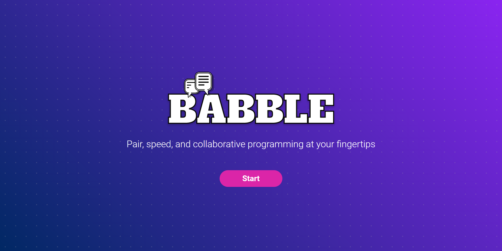
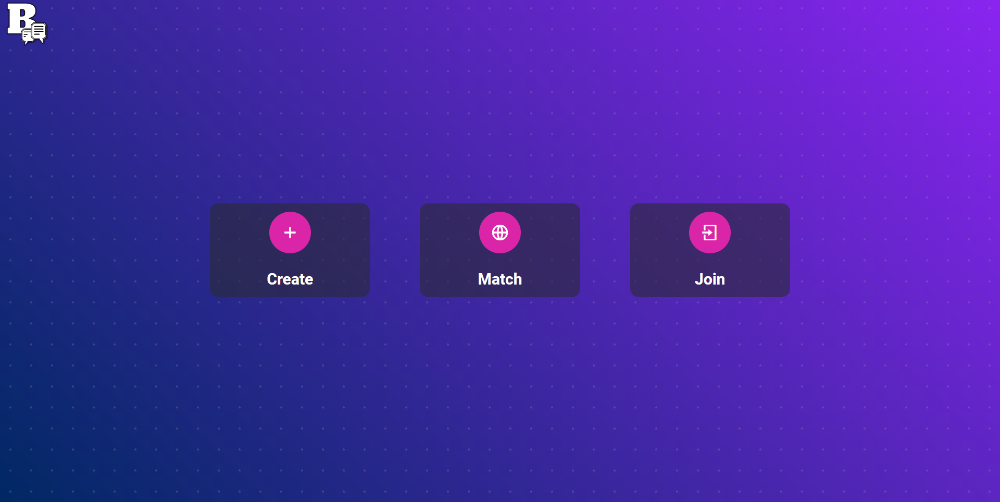
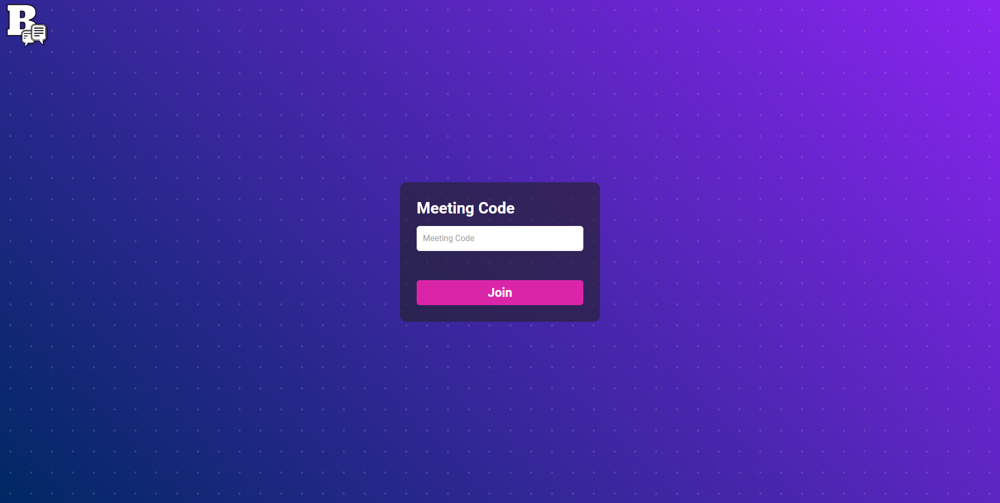

<p align="center">
  
</p>

---


[Babble](https://www.letsbabble.tech/) is a web application that enables pair programming for everyone by providing live video chat and built-in synchronous text workspace support.

## Table of Contents 🗺️

- [Description](#description)
- [Demo](#demo)
- [Site](#site)
- [Technologies](#technologies)
- [Usage](#usage)
- [Development](#development)
- [Contributing](#contributing)
- [License](#license)

## Description ✏️

[Babble](https://www.letsbabble.tech/) is a web application that provides live video chat and text field services. It enables people from around the world to work together. Users can create rooms, invite people, live video chat and type in a shared text field. In the future, you will be able to match with a random Babble user, even if they are on the other side of the world. Connect with programmers from all around the world!

## Demo 💾

Live demo available here: https://www.letsbabble.tech/

## Site 🖥️

### Landing Page



### Selection



### Join



### Video


## Technologies ⚙️

- [Vue.js](https://vuejs.org/) / [Tailwind CSS](https://tailwindcss.com/) / [Jest](https://jestjs,io/)
- [Express.js](https://expressjs.com/) / [PeerJS](https://peerjs.com/)
- [Firepad](https://firepad.io/) / [Firebase](https://firebase.google.com/)
- [Vercel](https://vercel.com/) / [Heroku](https://heroku.com)

## Usage 💡

- Open [Babble](https://www.letsbabble.tech/).
- Create a new room and/or join a room.
- Chat and type!

## Development 🛠

**Note:** A Firebase app must be configured with a realtime-database that the editor can have **read/write** permissions to

1. Include the following .env in the project root

```
VUE_APP_FB_APP_ID=        # Firebase App Id
VUE_APP_FB_DB_URL=        # Firebase Database URL
VUE_APP_FB_AUTH_DOMAIN=   # Firebase Auth Domain
VUE_APP_FB_API_KEY=       # Firebase API Key
```

2. Install frontend dependencies and serve the vue app

```
cd frontend && npm install
npm run serve
```

3. Install backend dependencies and launch express server

```
cd backend && npm install
npm run dev
```

## Contributing 💬

We encourage you to contribute to Babble! Please checkout the [Contributing to Babble guide](/CONTRIBUTING.md) to get a better undrstanding on how to contribute.

## License 📝

Babble is licensed under the [GNU General Public License v3.0](/LICENSE) and is available for free.
